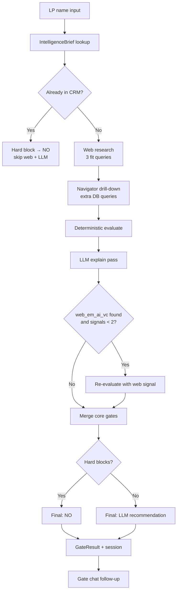
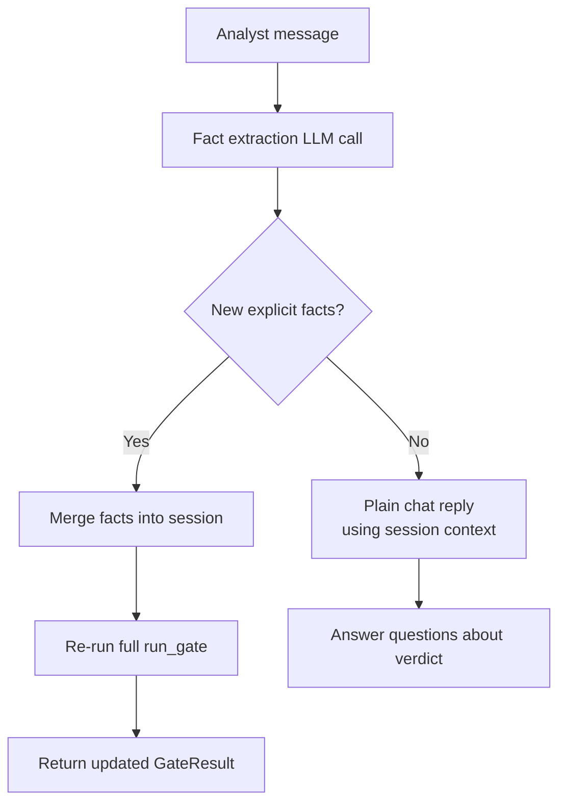

# LP Gate — How It Works

LP Gate is Contra's institutional LP screening system. Given a name, it answers one question:

> **Should this LP be added to FundingStack CRM?**

The answer is one of three verdicts:

| Verdict | Meaning |
|---------|---------|
| **YES** | Strong fit — add to CRM and pursue outreach |
| **REVIEW** | Plausible fit but evidence is thin or mixed — a human should look closer |
| **NO** | Poor fit or blocked — skip |

LP Gate is built for **MyAsiaVC / Contra VC** (AI-native VC, emerging markets, $30M Fund I). It screens for LPs who commit to **VC funds** as limited partners — not direct-only angels or PE-only investors — with appetite for **emerging managers** and **AI/tech** exposure in **Southeast Asia, North America, or the Middle East**.

---

## High-level architecture

LP Gate uses a **two-layer decision system**:

1. **Deterministic evaluator** (`contra/gate/evaluator.py`) — pure Python logic over database records, ICP scores, syndicate history, and analyst-provided facts. Produces a structured `GateAssessment` with hard blocks, core gates, and a signal checklist.
2. **LLM explain pass** (`contra/gate/verdict.py`) — an LLM reads the assessment, web research, and drill-down results, then makes a **holistic probabilistic judgment**. The LLM is the primary decision-maker for non-blocked cases.

Hard blocks always win. Everything else is decided by the LLM's `llm_recommendation`, informed by (but not bound to) the evaluator's signal-count heuristic.



---

## Entry points

LP Gate can be invoked three ways:

| Surface | Path / command | Notes |
|---------|----------------|-------|
| **CLI** | `contra gate "LP Name"` | Rich terminal output; `--json` for machine-readable |
| **REST API** | `POST /api/gate` | Returns `GateResult` JSON |
| **Web UI** | `contra-web/app/gate/page.tsx` | Search box → verdict thread with follow-up chat |

Follow-up questions and re-screening use `POST /api/gate/chat` with the `session_id` returned from the initial screen.

---

## Pipeline phases

The orchestrator is `run_gate()` in `contra/gate/runner.py`.

### Phase 0 — IntelligenceBrief lookup

`lookup(con, name)` in `contra/intelligence/brief.py` resolves the input name against `contra.duckdb` and assembles an `IntelligenceBrief`:

- **Name resolution** — fuzzy match via `resolve()`; returns `matched_name`, `match_confidence`, `match_method`, `allocator_id`
- **CRM check** — whether the LP already exists in FundingStack CRM
- **ICP profile** — tier, fit score, `core_pass`, exclusion status, per-gate evidence (`c1`–`c4`)
- **Syndicate profile** — fund deal count, total committed USD, `is_fund_lp`, `is_upgrade_candidate`
- **Graph connectivity** — warm path count, investment count
- **Benchmark rank** — position on Contra Top-200 list
- **Signals & rejections** — top structured signals and stated rejection reasons
- **Contacts** — LinkedIn/CRM contact rows when available

If the LP is not in the database, the brief is still returned with low match confidence and empty ICP fields. **Missing from the database is not a hard block** — web research and LLM judgment fill the gap.

### Phase 1 — Hard CRM short-circuit

If `brief.in_crm` is true, the gate immediately returns **NO** without web search or LLM:

- Deterministic `evaluate()` runs to populate hard blocks
- `explain_hard_block()` builds a static explanation
- Web research is skipped entirely

### Phase 2 — Web research

`search_lp(name)` in `contra/gate/research.py` runs **three targeted queries** via Tavily:

1. `"{name}" investor portfolio venture capital fund LP`
2. `"{name}" emerging markets Asia Africa investment portfolio`
3. `"{name}" artificial intelligence technology fund commitment`

Results are deduplicated by URL, ranked by relevance score, capped at 10 sources, and compiled into a ~2,500-character context block for the LLM.

**Requirement:** `PULSE_SEARCH_PROVIDER=tavily` and `TAVILY_API_KEY` must be set. Without them, gate screening fails for new (non-CRM) LPs.

### Phase 3 — Navigator drill-down

`run_drill_down(con, brief)` executes up to two additional SQL templates based on data coverage:

| Coverage | Condition | Queries run |
|----------|-----------|-------------|
| **none** | No confident DB match | Fuzzy alias lookup, document search |
| **thin** | Match confidence ≥ 0.70 | LP profile, document search |
| **partial** | Allocator ID + confidence ≥ 0.85 | LP signals; relationships if no warm paths |
| **rich** | Confidence ≥ 0.92 + ICP tier | No extra drill-down |

Drill-down results are passed to the LLM as supplementary backend context.

### Phase 4 — Deterministic evaluation

`evaluate(brief, analyst_facts, web_em_ai_vc=False)` produces a `GateAssessment`:

- Hard blocks
- Core gate checks (C1–C4)
- Signal checklist with `signals_met` count
- Tentative recommendation (`yes` / `no` / `review`)

This assessment is **advisory** — it is passed to the LLM as structured input, not as the final verdict.

### Phase 5 — LLM explain pass

`explain()` calls the configured LLM (via `PULSE_LLM_PROVIDER`) with the prompt in `prompts/navigator/gate_explain.yaml`. The LLM returns a `GateExplanation` containing:

- `llm_recommendation` — the LLM's holistic yes/no/review call
- `confidence` — high / medium / low
- `reasons`, `backend_evidence`, `online_evidence`, `conflicts`, `summary`
- Flat core gate fields (`c1_status`–`c4_status` + evidence strings) assessed from web research
- Graded appetite fields (`em_appetite`, `fund_i_appetite`, `ai_tech_appetite`, `venture_appetite`, `geography_appetite`) plus per-dimension evidence strings
- `lp_commitments_found[]` — explicit external LP fund commitments the LLM confirmed (empty if none found)
- `primary_blocker` — single decisive phrase for NO verdicts
- `negative_flags[]` — disqualifying evidence tags (e.g. `no_fund_lp_history`, `pe_only`, `direct_only`)

**Requirement:** `PULSE_LLM_PROVIDER` and the matching API key must be set.

### Phase 6 — Appetite validator (deterministic guardrails)

`validate_and_patch()` in `contra/gate/appetite_validator.py` applies hard rules to the LLM output **before** the appetite profile is built. This catches common LLM errors:

| Condition | Correction |
|-----------|------------|
| GP/Principal title in NFX context + no external LP commits | Add `no_fund_lp_history` flag; cap `em_appetite`, `fund_i_appetite` to `unknown` |
| `em_appetite` moderate/strong but no LP commit language in `allocation_evidence` | Downgrade to `unknown` |
| `allocation_evidence` entries reference employer fund's portfolio | Strip employer portfolio entries |
| `nfx_individual` mode + any strong negative flag | Force `llm_recommendation = "no"` |

The validator never upgrades verdicts — only corrects downward.

### Phase 7 — Post-LLM evaluation and final decision

1. **Re-evaluate** with the validated `AppetiteProfile` (adds graded appetite signals toward the ≥2 bar).
2. **Final recommendation:** Hard blocks → `no`. Otherwise: `apply_appetite_adjustments(llm_recommendation, appetite, screening_mode)`.
3. **Core gate merge:** Evaluator's DB-backed gates win over LLM when definite. `unknown` evaluator gates are filled by LLM's web assessment.
4. **Result packaging:** `GateResult` assembled with `session_id`, `lp_commitments_found`, `primary_blocker`, and `pitchbook_status`.

---

## Hard blocks

Hard blocks force **NO** regardless of signals or LLM opinion. They are evaluated deterministically and cannot be overridden.

| Block | Trigger |
|-------|---------|
| **Already in CRM** | `brief.in_crm == true` |
| **ICP excluded** | `brief.excluded == true` (with or without a recorded reason) |
| **Direct / PE-only** | `exclusion_reason` contains phrases like "direct-only", "pe-only", "does not invest in funds" |

When a hard block fires, web search and the full LLM pass are skipped (CRM block) or the LLM recommendation is overridden to `no`.

---

## Core gates (C1–C4)

Core gates are the ICP qualification filters from the LP scoping model. Each gate is `pass`, `fail`, or `unknown`.

| Gate | Label | What it tests |
|------|-------|---------------|
| **C1** | VC fund LP | Does the LP commit to VC funds (not direct-only, not PE-only)? |
| **C2** | Emerging manager | Evidence of backing first-/second-time or emerging GPs? |
| **C3** | AI / tech | Thesis or portfolio touches AI, robotics, deep tech, software? |
| **C4** | Geography | Invests in SE Asia, North America, Middle East, or global mandate? |

### How the evaluator assesses core gates

**C1** passes if any of:

- Syndicate profile shows `is_fund_lp` (behaviorally confirmed fund LP)
- Analyst facts mention VC fund commitment (e.g. "fund lp", "invest in fund")
- ICP evidence text contains "pass"

Otherwise C1 is `fail` or `unknown` depending on available evidence.

**C2–C4** are derived from ICP evidence text in the database. If no ICP score exists, they default to `unknown` unless analyst facts provide hints (e.g. "emerging manager" for C2, "ai"/"tech" for C3, geography keywords for C4).

### How the LLM supplements core gates

When gates are `unknown` because the LP is not in prospect sheets, the LLM assesses C1–C4 probabilistically from web research and general knowledge. These web-inferred gates are merged in only where the evaluator could not reach a definite pass/fail.

In the web UI, gate chips show their source: backend (DB), web (LLM inference), or analyst (chat-provided facts).

---

## Signal checklist

Beyond core gates, LP Gate tracks **qualifying signals** — independent evidence points toward CRM admission. The evaluator requires **≥ 2 met signals** for a tentative YES.

| Signal ID | Label | Source | Met when |
|-----------|-------|--------|----------|
| `icp_qualified` | ICP Qualified (Tier 1/2 + core pass) | backend | `icp_tier` is `tier_1` or `tier_2` AND `core_pass` is true |
| `syndicate_fund_lp` | Syndicate Fund-LP Behavior | syndicate | `is_fund_lp` in syndicate profile |
| `syndicate_upgrade` | Syndicate Upgrade Candidate | syndicate | ≥1 fund deal AND ≥$5k committed |
| `warm_path` | Warm Intro Path | backend | `warm_path_count > 0` in network graph |
| `benchmark_rank` | Contra Top-200 Ranking | backend | LP appears on benchmark list |
| `appetite_emerging_manager` | Inferred Emerging-Manager / Fund-I Appetite | web | `em_appetite` or `fund_i_appetite` ≥ moderate (from LP allocation behavior, not GP role) |
| `appetite_ai_tech` | Inferred AI / Tech Appetite | web | `ai_tech_appetite` ≥ moderate |
| `appetite_venture_fit` | Inferred Venture Fund-LP Appetite | web | `venture_appetite` ≥ moderate |
| `analyst_fact_1/2` | Analyst Context | analyst | Analyst provided explicit facts (capped at 2 signal points) |

### Tentative recommendation rules (evaluator)

```
if hard_blocks:
    → NO
elif signals_met >= 2:
    → YES
elif signals_met == 1
     OR (syndicate_upgrade_candidate AND ≥2 unknown core gates):
    → REVIEW
else:
    → NO
```

The LLM may override this heuristic (except for hard blocks). For example, a well-known fund-of-funds GP with zero database signals might still receive YES or REVIEW based on web evidence.

---

## Screening modes

`run_gate()` accepts a `screening_mode` parameter that governs verdict strictness:

| Mode | Call surface | Default posture | GP + no LP evidence |
|------|-------------|-----------------|---------------------|
| `nfx_individual` | NFX Signal batch, NFX selenium scraper | Lean **NO** when C1 unconfirmed | → **NO** |
| `institutional` | CLI, REST API, manual screens | Lean **REVIEW** when C1 uncertain | → **REVIEW** |

The NFX batch (`batch_gate_run`) and selenium scraper automatically pass `screening_mode="nfx_individual"`. All other callers default to `institutional`.

---

## EM appetite rules

EM appetite (`em_appetite`, `fund_i_appetite`) requires **explicit evidence of LP capital committed to external VC funds**. The following do NOT qualify:

- Being employed at / working for an emerging manager
- Angel deals into startups
- Articles or media about emerging managers in general
- NFX Signal profile listing emerging-market sectors

The `appetite_emerging_manager` signal is only met when `em_appetite` or `fund_i_appetite` is `moderate` or `strong`, which in turn requires at least one named external LP commitment in `allocation_evidence`. The appetite validator (`appetite_validator.py`) enforces this deterministically after the LLM pass.

---

## Name match guard

When the database resolver matches an input name to a different person via alias or fuzzy match (e.g. "Will Bricker" → "Will Au"), the `match_untrusted` flag is set on `IntelligenceBrief`. The heuristic checks whether the last significant token of the input name appears in the matched name — if not, the match is flagged unreliable.

Consequences of `match_untrusted = True`:
- Evaluator treats the LP as having no database record (ICP/syndicate signals not counted)
- LLM prompt receives an explicit warning to ignore backend profile data
- The mismatch is noted in `conflicts[]`

---

## PitchBook enrichment

PitchBook profiles are injected into web research when session cookies are available at `processed_data/pb_session_cookies.json`. Gate already calls `_inject_pitchbook()` automatically.

To enable PitchBook enrichment:
1. Run `contra pitchbook-login` (or the `pitchbook_scraper.py` login flow) once
2. This saves `processed_data/pb_session_cookies.json`
3. Subsequent `contra gate` calls will automatically fetch and inject PitchBook profiles

`GateResult.pitchbook_status` reports the enrichment outcome: `"fetched"` | `"not_found"` | `"no_cookies"` | `"expired"`.

In compact_web batch mode, if a PitchBook profile is fetched, the web context budget is automatically raised from 1200 to 2500 chars so the structured LP data (AUM, LP type, recent commitments) is not truncated.

---

## Structured output fields

`GateResult` includes three new fields for decisive, actionable output:

| Field | Type | Description |
|-------|------|-------------|
| `lp_commitments_found` | `List[str]` | External LP fund commitments confirmed by the LLM, e.g. `["LP in Hustle Fund (2022) — Crunchbase"]` |
| `primary_blocker` | `str` | Single decisive phrase for NO verdicts, e.g. `"GP at Hustle Fund — no external LP commitments found"` |
| `pitchbook_status` | `str` | PitchBook enrichment status for this screen |

---

## LLM decision philosophy

The explain prompt (`gate_explain.yaml`) instructs the LLM to:

- Treat database signals as **inputs**, not the verdict
- **Not** default to NO just because the LP is missing from the database (institutional mode)
- Make a holistic judgment using web research, drill-down data, and general knowledge
- Assess C1–C4 probabilistically when the evaluator marks them unknown
- Apply the GP ≠ LP rule: employer fund's portfolio is never the person's `allocation_evidence`
- C2 and `em_appetite` default to `unknown` unless an external LP commitment is cited
- Cite specific evidence in `reasons`, `backend_evidence`, and `online_evidence`
- Note disagreements between backend and web in `conflicts[]`
- Write a decisive two-sentence `summary` — no hedge language for NO verdicts

---

## Gate chat and re-screening

After an initial screen, analysts can ask follow-up questions in the same thread. `process_message()` in `contra/gate/chat.py` handles this:



### Fact extraction

A structured LLM call (`AnalystFactExtraction`) distinguishes:

- **Facts** — "They backed Neon Fund I", "They have a $250M VC allocation", "They are based in Singapore"
- **Non-facts** — questions ("Why did C2 fail?"), opinions ("They seem like a good fit"), requests

Only explicit facts trigger a re-screen.

### Re-screen behavior

When new facts are found:

1. Facts are merged into the session's `analyst_facts` list (deduplicated)
2. `run_gate()` re-runs with the same `session_id` and updated facts
3. Analyst facts can pass core gates (C1 via "invest in fund" keywords; C2–C4 via hint keywords)
4. Up to 2 analyst facts count as met signals
5. A new `GateResult` is returned alongside a summary reply

### Question-only path

If the message contains no new facts, the chat LLM answers using the stored session context (assessment, explanation, conversation history) without re-running the evaluator.

---

## Session management

Gate sessions are stored in-memory with a **30-minute TTL** (`contra/gate/session.py`).

Each `GateSession` carries:

- `session_id`, `lp_name`
- Serialised `brief_dict`, `web_context`, `assessment_dict`, `result_dict`
- Growing `analyst_facts` and `message_history`

Sessions expire automatically. If a chat request references an expired session, the user is prompted to run a new gate screen.

---

## Response schema

The API returns a `GateResult`:

```json
{
  "session_id": "abc123...",
  "lp_name": "Example Family Office",
  "assessment": {
    "recommendation": "review",
    "hard_blocks": [],
    "core_gates": [
      { "gate": "c1", "status": "pass", "evidence": "...", "source": "web" }
    ],
    "signals": [ ... ],
    "signals_met": 1,
    "signals_required": 2
  },
  "yes": false,
  "is_review": true,
  "confidence": "medium",
  "reasons": ["..."],
  "backend_evidence": ["..."],
  "online_evidence": ["..."],
  "conflicts": [],
  "summary": "Two-sentence plain-English verdict.",
  "db_queries_used": ["lp_signals", "document_search"],
  "analyst_facts": []
}
```

Key convenience flags:

- `yes` — true when recommendation is `yes`
- `is_review` — true when recommendation is `review`

---

## Configuration

LP Gate requires external services for full screening of **new** LPs (not already in CRM):

| Variable | Purpose | Example |
|----------|---------|---------|
| `PULSE_LLM_PROVIDER` | LLM for explain + chat | `groq`, `anthropic`, `openai`, `gemini` |
| `GROQ_API_KEY` (etc.) | Provider API key | From provider console |
| `PULSE_SEARCH_PROVIDER` | Web search provider | `tavily` |
| `TAVILY_API_KEY` | Tavily API key | From tavily.com |

Copy `env.example` to `.env` in the `contra/` directory. Install gate dependencies:

```bash
cd contra
pip install -e ".[gate]"
```

CRM-blocked LPs only need the database (`contra.duckdb`) — no LLM or search keys required.

---

## Data dependencies

LP Gate reads from `contra.duckdb`, rebuilt from `raw_data/` via `contra refresh`. Key views and tables used:

| Resource | Used for |
|----------|----------|
| `v_lp_profile` | ICP tier, fit score, core gates, exclusions |
| `v_syndicate_profile` | Fund LP behavior, upgrade candidacy |
| `v_warm_paths` | Intro route discovery |
| `signals` | Top structured signals per allocator |
| `rejections` | Stated rejection reasons |
| `investments` | Deal count and commitment totals |
| `allocator_contacts` | Contact enrichment |
| CRM tables | Duplicate detection (`in_crm`) |

Web search results are cached at `processed_data/research_cache/` for reproducibility.

---

## Relationship to enrichment

LP Gate runs **Tavily web search synchronously** on every screen (except CRM hard-blocks). The LLM assesses C1–C4 and appetite from that web context even when the LP has no ICP row in the database.

On **YES** or **REVIEW**, gate **auto-persists** web/LLM findings to `allocators` (COALESCE-only — never overwrites existing non-null fields) and writes a provenance record to `entities_raw`.

**Batch enrich** (`contra enrich` / Admin) is optional — it backfills thousands of existing prospects in the data estate. It is **not** required for gate screening or gate chat. Gate chat should reference inline web evidence and re-screen with analyst facts, not redirect to Admin enrich.

---

## File map

| File | Role |
|------|------|
| `contra/gate/runner.py` | Pipeline orchestration |
| `contra/gate/evaluator.py` | Deterministic rules engine |
| `contra/gate/verdict.py` | LLM explain pass |
| `contra/gate/research.py` | Mandatory web search |
| `contra/gate/chat.py` | Follow-up chat + re-screening |
| `contra/gate/session.py` | In-memory session store |
| `contra/gate/models.py` | Pydantic schemas |
| `contra/intelligence/brief.py` | IntelligenceBrief assembly |
| `contra/intelligence/navigator.py` | Drill-down SQL templates |
| `api/routers/gate.py` | REST endpoints |
| `contra/cli.py` | `contra gate` command |
| `contra-web/app/gate/page.tsx` | Web screening UI |
| `contra-web/components/GateThread.tsx` | Verdict display + chat thread |
| `prompts/navigator/gate_explain.yaml` | LLM explain system prompt |
| `prompts/navigator/gate_chat.yaml` | Chat + fact extraction prompts |

---

## Example decision walkthrough

**Input:** `contra gate "Richard Liu GGV"`

1. **Brief lookup** — may or may not match a DB record; GGV Capital partner is likely identifiable via web even without DB coverage.
2. **Web research** — finds GGV Capital profile, Asia + US fund activity, tech focus.
3. **Drill-down** — if thin/none coverage, runs alias lookup and document search.
4. **Evaluator** — likely 0–1 signals met (no ICP tier, no syndicate history). Core gates mostly `unknown`. Tentative recommendation: `no` or `review`.
5. **LLM explain** — assesses C1 pass (GP at major VC fund), C3 pass (tech fund), C4 pass (US + Asia). Sets `llm_recommendation: "review"` or `"yes"` depending on fund-LP evidence.
6. **Merge** — LLM fills unknown core gates from web. Final recommendation follows LLM unless hard-blocked.
7. **Chat** — analyst asks "Do they back emerging managers?" → question-only reply. Analyst says "They committed to a Fund I vehicle last year" → fact extracted, re-screen runs, C2 may pass, signals bump toward YES.

---

## Design principles

1. **Explainability** — Every verdict includes structured gates, signals, cited evidence, and a plain-English summary.
2. **Database + web fusion** — Backend data wins when definitive; web and LLM fill gaps for LPs not yet in the data estate.
3. **Conservative hard blocks** — CRM duplicates and confirmed exclusions are never overridden.
4. **Human-in-the-loop** — REVIEW exists for thin evidence; chat lets analysts inject facts and re-screen without re-entering the name.
5. **No silent black box** — The deterministic layer is fully inspectable Python; the LLM layer returns structured JSON with explicit reasons and conflicts.
